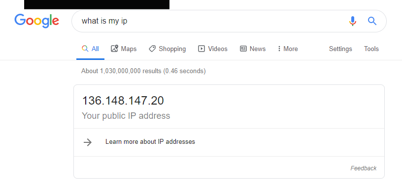
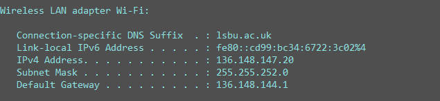
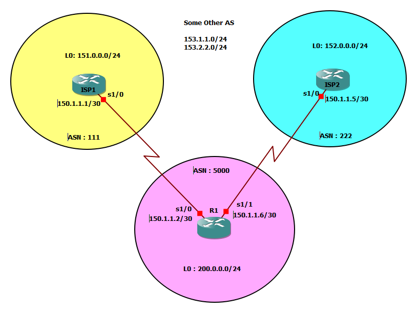

# Chapter 1 : BGP Foundation
* BGP - the biggest routing protocol in the world

## What is BGP
* Routing protocol of the internet 
    > Exterior Routing Protocol (Earlier it was EGP, phased out eventually)
* Management of Trust 
    >  for IGP there exists a implicit trust mechanism  
      BGP doesnt trust any body, even with neighbours it takes all measure to safe its AS  
      this is because BGP makes neighbours with external networks 
* Routing through autonomous systems (AS) instead routers
    > "Cloud is nothing without Datacenters" - Juniper  
    Everything ends with a Router 
* Slowest Routing protocol in the world 
    > by design it's not a fast protocol  
    BGP can't be super fast & Reactive (for this we've EIGRP)  
    In BGP, if route goes down, it waits for 30 secs. this is to prevent propagation of flapping  
* BGP is more for ISP not enterprise customer network 

## BGP talks between AS 
* AS : One or more network, managed by a single entity (e.g. intel is known as 442), 
however for some cases its managed by several orgs 
* Essentially, an AS comprises of a number of routers, having assigned with a public IP
address (220.5.1.0/24)
* I want people to reach me through internet, redundantly 
* may be there are many other networks inside the subjected AS. but you'll only advertise 
a public address (gateway) to the internet. 
* Other internal networks find their paths reach the gateway using IGP.
* NAT will help to map internal & external addresses. 
* The Entire AS is represented by a single public IP. 
* my public ip 
    > 
* my private ip `iponfig ` or `ifconfig` for windows and linux respectively 
    > 
* This is a special case for my University Network, try yours 
* If a link goes down in BGP, and the AS has redundant connection to multiple neighbouring
ASs, it can forward traffic through the AS. thus, __BGP can form neighbour even if they aren't 
physically connected__ which is called __iBGP__ (internal BGP), where the internal routers perhaps 
run high speed IGP (OSPF & EIGRP) but most preferably IS-IS (ISP's favourite)
* BGP tables can't be handled by IGPs but they can handle is route internally.  
* for a given AS, switching between two different exit point is not done by __Slow BGP__ but
__Fast IGP__ 

## BGP's default metric (Surface Level)
* Uses AS-Path attributes (kind of RIP's way).
* Hop Count but not routers but ASs.
* the decision is totally independent of Link speed, Reliability & Load.
* Its the job of the Admin to choose the path or rather __influence__ the route.

## Note
*  _what BGP is can't be told rather to be let experienced_

## When not to use BGP
1. you're only connected to one external ISP 
      * there's only one path to get out to the internet  
      * even if you have redundant links to a single ISP, still the case holds   
      * if your gateway router (g) is connected ISP router (r) via a modem. g may not know if r is down.
      * a BGP is a possible solution be using BGP as it provides __keep Alive__
      * however now a days __IP SLA__ feature defines probe packets to eliminate need of Keep-alive
2. If your router is not good enough 
      * GBP can easily overload routing table with 300K routes 
      * to run BGP you need a high performance router (min 512MB), for routers its a lot. 
3. If you don't have enough bandwidth to sync with BGP. BGP RFC gives measure (no of routes - BW)
4. You don't understand BGP 
      * possible to redistribute BGP routes into IGP routes - _Blow your router_
      
## When to use BGP
1. you need HA through multiple ISP 
2. you are an ISP 
3. Extremely large network to connect different branch or partner enterprises. 

## BGP Resume
1. Reliable Updates (TCP based : port 179)
2. Triggered (event based) Updates only [5 sec internal(iBGP) / 30 sec external (eBGP)] 
3. Complex Metric for finding best route (13 attributes). Top down in the attribute list until the tie breaks 
4. Manually setup neighbour (`neighbour` command sends a __open__ message no auto discovery)  
5. Complex Filters are typically used, to be __Sceptical__ about info coming from neighbours 
6. [Bonus] : you can do anything with filter config 

## The Golden Rule
_"BGP does not enable one AS to send traffic to a neighbour AS intending to that the traffic takes a different 
route from that, taken by traffic originating in the neighbour AS"_
>   Easy : You can't tell your neighbour what to do with their traffic.  
>   the sent packet can be replied through a completely different path. (although path can te influenced)

# Chapter 2 : BGP Session Establishment 
* BGP relationship facts
* BGP packets and process
* Configuring BGP

## BGP Neighborship Formation 
* Router never discover each other line IGP : 
    * in an IGP when someone puts a `network [net-id]` commands 3 things happen 
        1. router finds (an) interface(s) with IP matching that net-id
        2. sends hello with handshaking parameters through them
        3. advertises the network address configured on them (not the net-id)
    * in BGP neighbourship is manual (no hallo)
* Neighbours must be reachable on TCP port 179 : Mind your Firewall rules ! 
* multiple BGP session is not permitted (unlike OSPF/EIGRP)
* `Network` Command works differently with BGP :
    * If you want redundant link on your neighbour, adding the neighbour twice won't help, BGP will drop it.
    * To do that add a loopback interface. 
    * Add two static routes `ip route [loopback-ip] [remote1]` and `ip route [loopback-ip] [remote2]`
    * neighbour to the __loopback ip__
    * BGP will see two same cost route, and starts load balancing with Round-Robin 
    * _BGP uses foundation principles of IGP to operate_
    
## BHP Packets
1. __Open__ : Similar to Hello (Sent once)
2. __Update__: Route Updates 
3. __Keep Alive__: relies on TCP keepalive to maintain connection (Periodic). 
TCP can be very quite thus to tell am I dead ot there's nothing going on 
4. __Notification__: Something's wrong

## BGP States
1. __Idle__ : I've a neighbour configured, I haven't tried to talk to him
2. __Active__ : I'm trying to break the communication (Prob: No response, no reachability) 
3. __Open Sent__ : Open is sent 
4. __Open Confirm__: Open is recieved 
6. __Ehtablished__: Done!

## BGP Lab 

### Autonomous System Number 
* __Private ASN__ : 64512 - 65535
* __Public ASN__ : 1 - 64511

### Interface Config 
__ISP1__
~~~
conf t

!---------------------------------------------
! Interace Config 
!---------------------------------------------
	int f0/0
	ip add 150.1.1.1 255.255.255.252 
	no sh
	
	int l0
	ip add 151.0.0.1 255.255.255.0
exit
!---------------------------------------------
! BGP Config 
!---------------------------------------------
	router bgp 111 
	nei 150.1.1.2 remote-as 500
end
wr
~~~
__ISP2__
~~~
conf t

!---------------------------------------------
! Interace Config 
!---------------------------------------------
	int f0/0
	ip add 150.1.1.5 255.255.255.252 
	no sh
	
	int l0
	ip add 152.0.0.1 255.255.255.0
exit
!---------------------------------------------
! BGP Config 
!---------------------------------------------
	router bgp 222
	nei 150.1.1.6 remote-as 500
end
wr
~~~
__R1__
~~~
conf t

!---------------------------------------------
! Interace Config 
!---------------------------------------------
	int f0/0
	ip add 150.1.1.2 255.255.255.252 
	no sh
	
	int f0/1
	ip add 150.1.1.6 255.255.255.252 
	no sh
	
	int l0
	ip add 200.0.0.1 255.255.255.0
exit	
!---------------------------------------------
! BGP Config 
!---------------------------------------------
	router bgp 500
	nei 150.1.1.1 remote-as 111
	nei 150.1.1.5 remote-as 222
end
wr
~~~

### BGP Cnfiguration
* __Start the BGP Process__
`router bgp [asn]`
