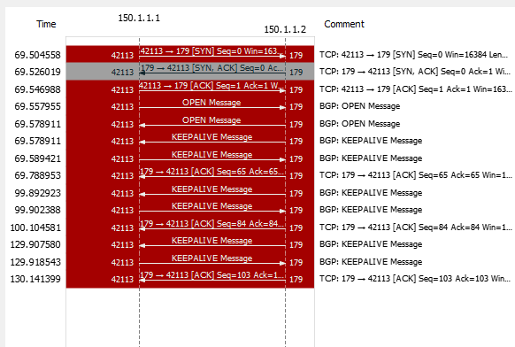

# Chapter 1 : BGP Foundation
* BGP - the biggest routing protocol in the world

## What is BGP
* Routing protocol of the internet 
    > Exterior Routing Protocol (Earlier it was EGP, phased out eventually)
* Management of Trust 
    >  for IGP there exists a implicit trust mechanism  
      BGP doesnt trust any body, even with neighbours it takes all measure to safe its AS  
      this is because BGP makes neighbours with external networks 
* Routing through autonomous systems (AS) instead routers
    > "Cloud is nothing without Datacenters" - Juniper  
    Everything ends with a Router 
* Slowest Routing protocol in the world 
    > by design it's not a fast protocol  
    BGP can't be super fast & Reactive (for this we've EIGRP)  
    In BGP, if route goes down, it waits for 30 secs. this is to prevent propagation of flapping  
* BGP is more for ISP not enterprise customer network 

## BGP talks between AS 
* AS : One or more network, managed by a single entity (e.g. intel is known as 442), 
however for some cases its managed by several orgs 
* Essentially, an AS comprises of a number of routers, having assigned with a public IP
address (220.5.1.0/24)
* I want people to reach me through internet, redundantly 
* may be there are many other networks inside the subjected AS. but you'll only advertise 
a public address (gateway) to the internet. 
* Other internal networks find their paths reach the gateway using IGP.
* NAT will help to map internal & external addresses. 
* The Entire AS is represented by a single public IP. 
* my public ip 
    > 
* my private ip `iponfig ` or `ifconfig` for windows and linux respectively 
    > 
* This is a special case for my University Network, try yours 
* If a link goes down in BGP, and the AS has redundant connection to multiple neighbouring
ASs, it can forward traffic through the AS. thus, __BGP can form neighbour even if they aren't 
physically connected__ which is called __iBGP__ (internal BGP), where the internal routers perhaps 
run high speed IGP (OSPF & EIGRP) but most preferably IS-IS (ISP's favourite)
* BGP tables can't be handled by IGPs but they can handle is route internally.  
* for a given AS, switching between two different exit point is not done by __Slow BGP__ but
__Fast IGP__ 

## BGP's default metric (Surface Level)
* Uses AS-Path attributes (kind of RIP's way).
* Hop Count but not routers but ASs.
* the decision is totally independent of Link speed, Reliability & Load.
* Its the job of the Admin to choose the path or rather __influence__ the route.

## Note
*  _what BGP is can't be told rather to be let experienced_

## When not to use BGP
1. you're only connected to one external ISP 
      * there's only one path to get out to the internet  
      * even if you have redundant links to a single ISP, still the case holds   
      * if your gateway router (g) is connected ISP router (r) via a modem. g may not know if r is down.
      * a BGP is a possible solution be using BGP as it provides __keep Alive__
      * however now a days __IP SLA__ feature defines probe packets to eliminate need of Keep-alive
2. If your router is not good enough 
      * GBP can easily overload routing table with 300K routes 
      * to run BGP you need a high performance router (min 512MB), for routers its a lot. 
3. If you don't have enough bandwidth to sync with BGP. BGP RFC gives measure (no of routes - BW)
4. You don't understand BGP 
      * possible to redistribute BGP routes into IGP routes - _Blow your router_
      
## When to use BGP
1. you need HA through multiple ISP 
2. you are an ISP 
3. Extremely large network to connect different branch or partner enterprises. 

## BGP Resume
1. Reliable Updates (TCP based : port 179)
2. Triggered (event based) Updates only [5 sec internal(iBGP) / 30 sec external (eBGP)] 
3. Complex Metric for finding best route (13 attributes). Top down in the attribute list until the tie breaks 
4. Manually setup neighbour (`neighbour` command sends a __open__ message no auto discovery)  
5. Complex Filters are typically used, to be __Sceptical__ about info coming from neighbours 
6. [Bonus] : you can do anything with filter config 

## The Golden Rule
_"BGP does not enable one AS to send traffic to a neighbour AS intending to that the traffic takes a different 
route from that, taken by traffic originating in the neighbour AS"_
>   Easy : You can't tell your neighbour what to do with their traffic.  
>   the sent packet can be replied through a completely different path. (although path can te influenced)

# Chapter 2 : BGP Session Establishment 
* BGP relationship facts
* BGP packets and process
* Configuring BGP

## BGP Neighborship Formation 
* Router never discover each other line IGP : 
    * in an IGP when someone puts a `network [net-id]` commands 3 things happen 
        1. router finds (an) interface(s) with IP matching that net-id
        2. sends hello with handshaking parameters through them
        3. advertises the network address configured on them (not the net-id)
    * in BGP neighbourship is manual (no hallo)
* Neighbours must be reachable on TCP port 179 : Mind your Firewall rules ! 
* multiple BGP session is not permitted (unlike OSPF/EIGRP)
* `Network` Command works differently with BGP :
    * If you want redundant link on your neighbour, adding the neighbour twice won't help, BGP will drop it.
    * To do that add a loopback interface. 
    * Add two static routes `ip route [loopback-ip] [remote1]` and `ip route [loopback-ip] [remote2]`
    * neighbour to the __loopback ip__
    * BGP will see two same cost route, and starts load balancing with Round-Robin 
    * _BGP uses foundation principles of IGP to operate_
    
## BHP Packets
1. __Open__ : Similar to Hello (Sent once)
2. __Update__: Route Updates 
3. __Keep Alive__: relies on TCP keepalive to maintain connection (Periodic). 
TCP can be very quite thus to tell am I dead ot there's nothing going on 
4. __Notification__: Something's wrong

## BGP States
1. __Idle__ : I've a neighbour configured, I haven't tried to talk to him
2. __Active__ : I'm trying to break the communication (Prob: No response, no reachability) 
3. __Open Sent__ : Open is sent 
4. __Open Confirm__: Open is recieved 
6. __Ehtablished__: Done!

## BGP Lab 

### Autonomous System Number 
* __Private ASN__ : 64512 - 65535
* __Public ASN__ : 1 - 64511

### Interface Config 
__ISP1__
~~~
conf t
!---------------------------------------------
! Interace Config 
!---------------------------------------------
	int f0/0
	ip add 150.1.1.1 255.255.255.252 
	no sh
	
	int l0
	ip add 151.0.0.1 255.255.255.0
exit
!---------------------------------------------
! BGP Config 
!---------------------------------------------
	router bgp 111 			  !Turning BGP On with ASN
	nei 150.1.1.2 remote-as 500	  !Adding Neighbour Manually
	net 151.0.0.0 mask 255.255.255.0  !Advertising network
end
wr
~~~
__ISP2__
~~~
conf t
!---------------------------------------------
! Interace Config 
!---------------------------------------------
	int f0/0
	ip add 150.1.1.5 255.255.255.252 
	no sh
	
	int l0
	ip add 152.0.0.1 255.255.255.0
exit
!---------------------------------------------
! BGP Config 
!---------------------------------------------
	router bgp 222
	nei 150.1.1.6 remote-as 500
	net 152.0.0.0 mask 255.255.255.0
end
wr
~~~
__R1__
~~~
conf t
!---------------------------------------------
! Interace Config 
!---------------------------------------------
	int f0/0
	ip add 150.1.1.2 255.255.255.252 
	no sh
	
	int f0/1
	ip add 150.1.1.6 255.255.255.252 
	no sh
	
	int l0
	ip add 200.0.0.1 255.255.255.0
exit	
!---------------------------------------------
! BGP Config 
!---------------------------------------------
	router bgp 500
	nei 150.1.1.1 remote-as 111
	nei 150.1.1.5 remote-as 222
	net 200.0.0.0 mask 255.255.255.0
end
wr
~~~

### BGP Message Exchange 
* Wireshark capture on f0/0 interface of R1

    
    
* Debug of BGP process `debug ip bgp all` on R1 
    ~~~
    *Mar  1 00:03:48.299: BGP: 150.1.1.1 passive open to 150.1.1.2
    *Mar  1 00:03:48.299: BGP: 150.1.1.1 went from Idle to Connect
    *Mar  1 00:03:48.307: BGP: 150.1.1.1 rcv message type 1, length (excl. header) 26
    *Mar  1 00:03:48.307: BGP: 150.1.1.1 rcv OPEN, version 4, holdtime 180 seconds
    *Mar  1 00:03:48.311: BGP: 150.1.1.1 went from Connect to OpenSent
    *Mar  1 00:03:48.311: BGP: 150.1.1.1 sending OPEN, version 4, my as: 500, holdtime 180 second                                                                                                s
    *Mar  1 00:03:48.311: BGP: 150.1.1.1 rcv OPEN w/ OPTION parameter len: 16
    *Mar  1 00:03:48.311: BGP: 150.1.1.1 rcvd OPEN w/ optional parameter type 2 (Capability) len                                                                                                 6
    *Mar  1 00:03:48.311: BGP: 150.1.1.1 OPEN has CAPABILITY code: 1, length 4
    *Mar  1 00:03:48.315: BGP: 150.1.1.1 OPEN has MP_EXT CAP for afi/safi: 1/1
    *Mar  1 00:03:48.315: BGP: 150.1.1.1 rcvd OPEN w/ optional parameter type 2 (Capability) len                                                                                                 2
    *Mar  1 00:03:48.315: BGP: 150.1.1.1 OPEN has CAPABILITY code: 128, length 0
    *Mar  1 00:03:48.315: BGP: 150.1.1.1 OPEN has ROUTE-REFRESH capability(old) for all address-f                                                                                                amilies
    *Mar  1 00:03:48.315: BGP: 150.1.1.1 rcvd OPEN w/ optional parameter type 2 (Capability) len                                                                                                 2
    *Mar  1 00:03:48.319: BGP: 150.1.1.1 OPEN has CAPABILITY code: 2, length 0
    *Mar  1 00:03:48.319: BGP: 150.1.1.1 OPEN has ROUTE-REFRESH capability(new) for all address-f                                                                                                amilies
    BGP: 150.1.1.1 rcvd OPEN w/ remote AS 111
    *Mar  1 00:03:48.319: BGP: 150.1.1.1 went from OpenSent to OpenConfirm
    *Mar  1 00:03:48.319: BGP: 150.1.1.1 send message type 1, length (incl. header) 45
    *Mar  1 00:03:48.339: BGP: 150.1.1.1 went from OpenConfirm to Established
    *Mar  1 00:03:48.339: %BGP-5-ADJCHANGE: neighbor 150.1.1.1 Up
    ~~~

### Verify BGP Summary 
* `sh ip bgp summary ` : make sure the state is a number (the nombe of routes it learns... )
    ~~~
    Neighbor        V    AS MsgRcvd MsgSent   TblVer  InQ OutQ Up/Down  State/PfxRcd
    150.1.1.1       4   111      31      33        4    0    0 00:27:21        1
    150.1.1.5       4   222      31      33        4    0    0 00:27:25        1
    ~~~
    
* `sh ip route bgp` : see the route learnd from BGP (From ISP1)
    ~~~
         152.0.0.0/24 is subnetted, 1 subnets
    B       152.0.0.0 [20/0] via 150.1.1.5, 00:08:21
        151.0.0.0/24 is subnetted, 1 subnets
    B       151.0.0.0 [20/0] via 150.1.1.1, 00:13:32
    ~~~
    
* `sh ip bgp` : shows the BGP Topology table 
    ~~~
    BGP table version is 4, local router ID is 200.0.0.1
    Status codes: s suppressed, d damped, h history, * valid, > best, i - internal,
                  r RIB-failure, S Stale
    Origin codes: i - IGP, e - EGP, ? - incomplete
    
       Network          Next Hop            Metric LocPrf Weight Path
    *> 151.0.0.0/24     150.1.1.1                0             0 111   i
    *> 152.0.0.0/24     150.1.1.5                0             0 222   i
    *> 200.0.0.0        0.0.0.0                  0               32768 i
    ~~~

## BGP Metric 
Cisco call it BGP route Selection process. it checks in the following order 
1. Largest Weight - cisco prop. (see topology table)
2. Highest Local Preference - set by admin (see topology table)
3. Locally Originated - if its originated from your AS 
4. Shortest AS Path - Strongest manipulation you can do 
5. Lowest Origin type (i < e < ?) : internal < external < Unknown source (incomplete)
6. Lowest MED (Metric) : 
7. eBGP over iBGP
8. Lowest IGP metric to neighbour (Max paths check) : 
    * by default BGP doesnt do Load balaning 
    * if [1-8] all attributes tie, it'll try to pick a best route using 9,10
    * `max path [n]` is a command that dictates how many simulating paths can be used (n >= 2)
9. Older Route
10. Lowest Router ID 

### Influencing BGP Route 
* The weight attribute is a cisco propreatory attribute. but it's not shared 
* use the weight attribute to leverage any neighbour 
* command `neighbor [nei-ip] weight [w] `
    ~~~
    R1(config)#router bgp 500
    R1(config-router)#neighbor 150.1.1.1 weight 10
    
    R1(config-router)#do sh ip bgp
    BGP table version is 4, local router ID is 200.0.0.1
    Status codes: s suppressed, d damped, h history, * valid, > best, i - internal,
                  r RIB-failure, S Stale
    Origin codes: i - IGP, e - EGP, ? - incomplete
    
       Network          Next Hop            Metric LocPrf Weight Path
    *> 151.0.0.0/24     150.1.1.1                0             0 111 i
    *> 152.0.0.0/24     150.1.1.5                0             0 222 i
    *> 200.0.0.0        0.0.0.0                  0         32768 i
    ~~~
* No change !! , weight is considered as a filter. anytime a filter is altered 
BGP process has to be clear (Caution ! Don't do in production) with `clear ip bgp *`

    ~~~
       Network          Next Hop            Metric LocPrf Weight Path
    *> 151.0.0.0/24     150.1.1.1                0            10 111 i
    *> 152.0.0.0/24     150.1.1.5                0             0 222 i
    ~~~

## BGP Advertisement mechanism 
### BGP is a DVRP 
* By def, in DVRP router only learns routes from its neighbours
* Unlike LSRP where it creates a huge topology table for every router
* for the Scale of routes BGP handles an LSRP mechanism just wouldn't work 
* hence BGP is a DVRP 

there are 2 ways of advertising routes

### 1. The `network` Command 
* unlike the network command in IGP, in BGP _it takes a route from an existing routing table and advertises on BGP_
* for any route originating locally cisco will put a static weight 32768 
* net will be known this tagged by (i)
* Syntax : `network [exact-net] mask [mask]` 
    * exact-net will be looked on routing table (Unlike IGPs)
    * mask is optional if net-id is classful 

### 2.  the `redistribute` Command 
* use `redistribute connected` under router-bgp config mode 
* nets will be unknown and tagged by (?) 

    ~~~
       Network          Next Hop            Metric LocPrf Weight Path
    *> 150.1.1.0/30     0.0.0.0                  0         32768 ?
    *> 150.1.1.4/30     150.1.1.2                              0 500 222 ?
    *> 151.0.0.0/24     0.0.0.0                  0         32768 ?
    *> 152.0.0.0/24     150.1.1.2                              0 500 222 ?
    ~~~

### Need to use route filter 
prevent yourself from being a transit router (letting other ISP's routes pass through you). 

lets add some private networks on R1 Loopback interface 
~~~
R1#sh ip int br | ex unass
Interface                  IP-Address      OK? Method Status                Protocol
FastEthernet0/0            150.1.1.2       YES NVRAM  up                    up
FastEthernet0/1            150.1.1.6       YES NVRAM  up                    up
Loopback0                  200.0.0.1       YES NVRAM  up                    up
Loopback1                  10.1.0.1        YES manual up                    up
Loopback2                  10.2.0.1        YES manual up                    up
Loopback3                  10.3.0.1        YES manual up                    up
~~~

with `redistribute connected` all the private nets will also be advertised to the neighbour.
e.g. from ISP 1
~~~
ISP1#sh ip route bgp
     152.0.0.0/24 is subnetted, 1 subnets
B       152.0.0.0 [20/0] via 150.1.1.2, 00:04:16
B    200.0.0.0/24 [20/0] via 150.1.1.2, 00:03:46
     10.0.0.0/24 is subnetted, 3 subnets
B       10.2.0.0 [20/0] via 150.1.1.2, 00:03:46
B       10.3.0.0 [20/0] via 150.1.1.2, 00:03:46
B       10.1.0.0 [20/0] via 150.1.1.2, 00:03:46
     150.1.0.0/30 is subnetted, 2 subnets
B       150.1.1.4 [20/0] via 150.1.1.2, 00:04:16
~~~
 
to prevent this to happen, use __access/distribution list__ on r1
~~~
  do sh ip route con                         !see all connected routes
  access-list 10 permit 200.0.0.0 0.0.0.255  !permit 200.0.0.0/24
  access-list 10 permit 150.0.0.0 0.0.0.3    !permit 150.0.0.0/30
  router bgp 500    
  distribute-list 10 out connected           !filter all C routes with ACL10 b4 goin out
~~~
now check on ISP1
~~~
ISP1#sh ip route bgp
     152.0.0.0/24 is subnetted, 1 subnets
B       152.0.0.0 [20/0] via 150.1.1.2, 00:09:49
B    200.0.0.0/24 [20/0] via 150.1.1.2, 00:09:19
     150.1.0.0/30 is subnetted, 2 subnets
B       150.1.1.4 [20/0] via 150.1.1.2, 00:09:49
~~~

# Chapter 3 : BGP Attributes
* what are attributes
* Well-known Bgp attribites
* Optional BGP attributes

## what is BGP attributes
* characteristics attached to every route that's advertised 
* often used by BGP route selection process (except weight, as it's not advertised)
* Can be standard (well-known) or proprietary (optional)

## Well known attribute (Industry standard)
### Mandatory attributes (Have to be in the updates)
* __Origin__ : where did this route come from
    > * i : generated internally (default network command)
    > * e : generated EGP 
    > * ? : unknown origin (redistributed)
* __AS-Path__ : How many AS the route has passed through 
    > * every time a packet passes through, upon exit its stamped (Like Passport)
    > * BGP's loop prevention mechanism (most important reason to make internet distbuted)
* __Next hop  Address__ : different than a typical next-hop 

### Discretionary (optional) Attributes (don't have to be their)
* __Local preferecne__ :
* __Atomic Aggregation__ : a type of summary 

## Optional (Optionally Supported / procreatory)
* __Multi-Exit Desciminator (MED)__ : suggestion to your neighbour, asking for favour 
    > * non transitive : Once the packet leaves the AS, MED is stripped off 
    > * Another word "Metric" (Confusing !!) _this is not the metric of BGP, it's the list_ 

* __Aggregator__ : who did aggregation 
* __Community__ : BGP system within BGP system 

# Chapter 4 : Route Map
* What is Route Map ?
* Uses of route map in BGP
* Route Map configuration / application 

## What is Route Map 
* An ordered list of statements processed similar to an access list
* perform a series of IF/THEN statements, cisco calls (__MATCH/SET__)
* Typically Used for 
    > * Modifying BGP attributes
    > * Policy Routing (PBR)
    > * Route Filtering 
* Configured from GLobal Config `route map [name]`
* if you just create a map like this, it'll crate a permit entry with seq number 10
    ~~~
    R1(config)#route-map set_bgp_map
    R1(config-route-map)#do sh route-map
    route-map set_bgp_map, permit, sequence 10
      Match clauses:
      Set clauses:
      Policy routing matches: 0 packets, 0 bytes
    ~~~
    >* Permit/deny : Access Control statement 
* Route-map is used to set a policy such that, by __matching__ a set with some condition then __set__ something... 
## Usage : Matching is based on Access-list
    ~~~
    ip access-list stand [acl_name]
        permit [ip] [mask]
    exit
    route-map [name] [permit|deny] [seq number]
        match ip address [acl_name]
        set [action]
    ~~~
* example
    ~~~
      ip access-list standard match_2_route
        permit 2.2.0.0 0.0.255.255
      exit
          route-map set_bgp_map permit 10
          match ip address match_2_route
      exit
      do sh route-map
      R1(config-route-map)#do sh route-map
        route-map set_bgp_map, permit, sequence 10
          Match clauses:
            ip address (access-lists): match_2_route
          Set clauses:
          Policy routing matches: 0 packets, 0 bytes
        route-map set_bgp_map, permit, sequence 100
          Match clauses:
          Set clauses:
          Policy routing matches: 0 packets, 0 bytes
    ~~~
 * Adding multiple match statement under sequence number : AND
 * Adding multiple match statement in one line : OR