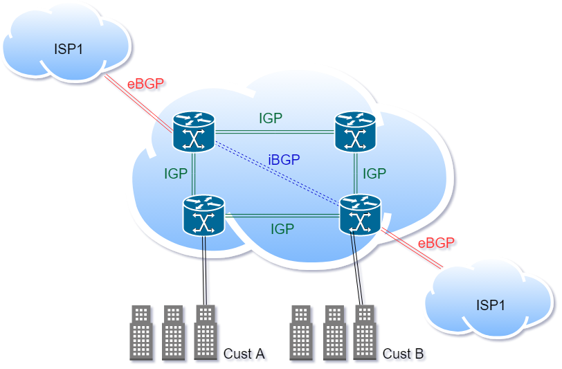

# Chapter 6 BGP ISP Basics: 
* Paradigm shift : you are a transit system, allows data to move between AS.
* eBGP : To receive routes from internet 
* IBGP : to establish connection between the AS
* BGP/IGP when to use 

## Design a transit system 

## iBGP
* Designed to simply passthrough an AS
* Doesn't modify any BGP attributes including AS-Path, Next-hop 
* __BGP split-horizon__ : never send an update to the same direction you received it (typically) in BGP : Never advertise a 
iBGP route to a iBGP peer 
* in iBGP doesn't have to be a directly connected to be a neighbour 
* advertise all your links with an IGP 
* iBGP uses a __Recursive Lookup__ to find a path to a non-connected neighbour. 

