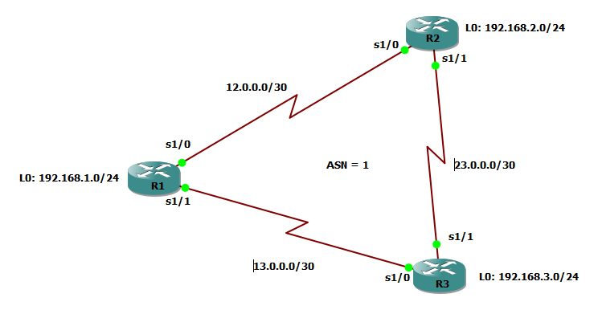
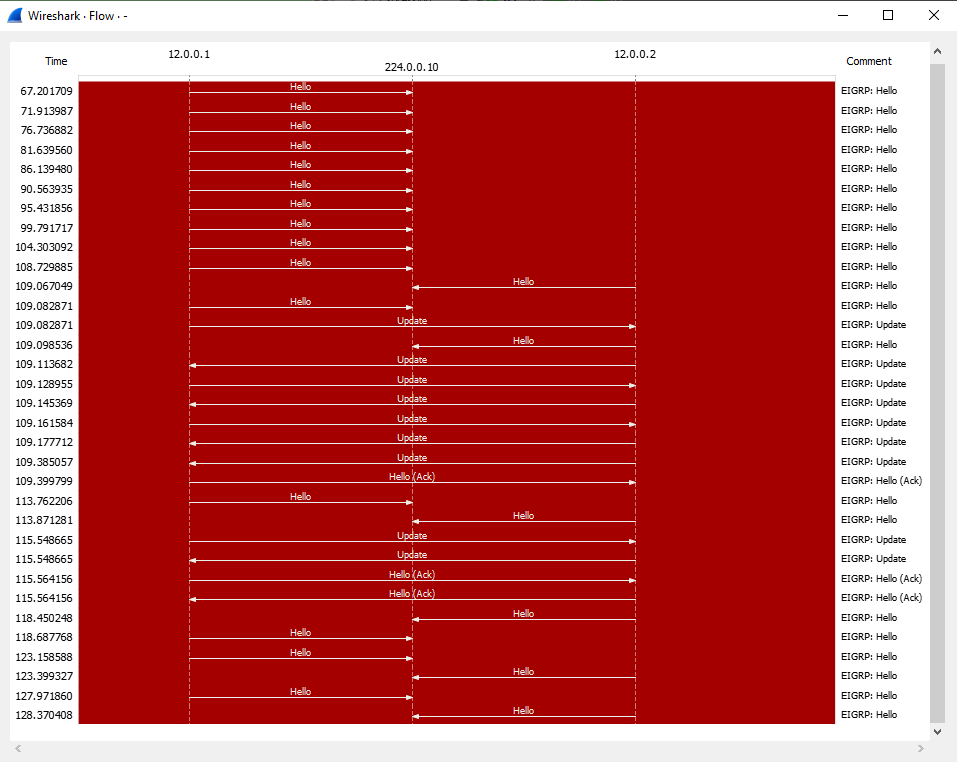
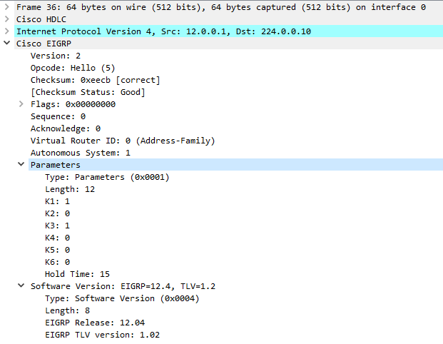
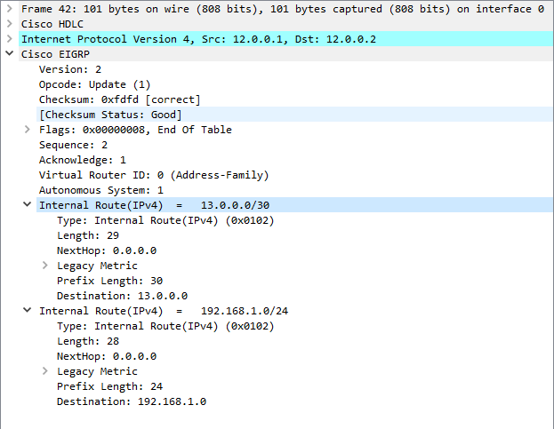
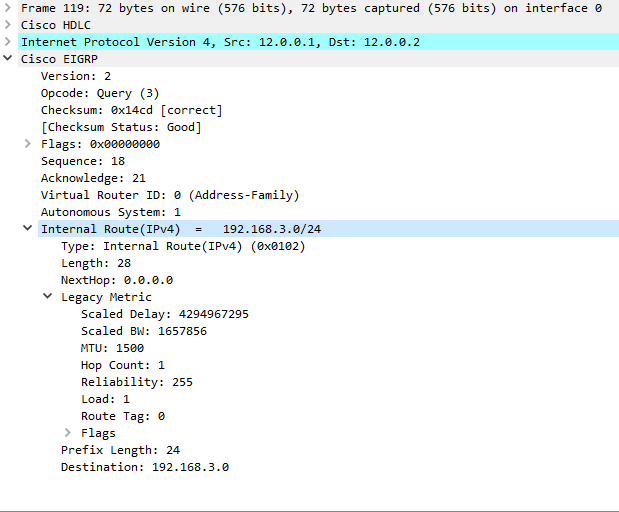
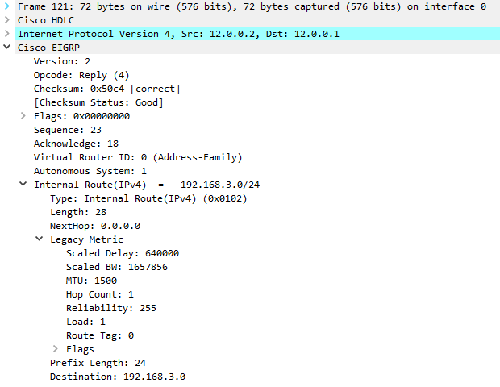

# Basic Setup 

## Step 1 : Configure Interfaces 
__R1__ 
~~~
conf t 
int s/0
  ip address 12.0.0.1 255.255.255.252
  no sh
int s1/1
  ip address 13.0.0.1 255.255.255.252
  no sh 
int l0
  ip address 192.168.1.1 255.255.255.0 
~~~

__R2__

~~~
conf t
int s1/0
  ip address 12.0.0.2 255.255.255.252
  no sh int s1/1
int s1/1
  ip address 23.0.0.1 255.255.255.252
  no sh 
int l0
  ip address 192.168.2.1 255.255.255.0
~~~

__R3__

~~~
conf t
int s1/0
  ip address 13.0.0.2 255.255.255.252
  no sh
int s1/1
  ip address 23.0.0.2 255.2555.255.252
  no sh 
int l0
  ip address 192.168.3.1 255.255.255.0
~~~

### Verify Interfaces 

~~~
R1#sh ip int br | inc up 
    Serial1/0                  12.0.0.1        YES manual up                    up      
    Serial1/1                  13.0.0.1        YES manual up                    up      
    Loopback0                  192.168.1.1     YES manual up                    up 

R2#sh ip int br | inc up 
    Serial1/0                  12.0.0.2        YES manual up                    up      
    Serial1/1                  23.0.0.1        YES manual up                    up      
    Loopback0                  192.168.2.1     YES manual up                    up 

R3#sh ip int br | inc up 
    Serial1/0                  13.0.0.2        YES manual up                    up      
    Serial1/1                  23.0.0.2        YES manual up                    up      
    Loopback0                  192.168.3.1     YES manual up                    up   
~~~

## Turn EIGRP On with ASN=1
do  this on all the 3 routers. 
~~~
router eigrp 1              ! turn EIGRP process for ASN=1
  no auto-summary           ! turn Auto-Summarisation off 
  network 0.0.0.0 0.0.0.0   ! run EIGRP on all interfaces
  exit                      ! exit form router configuration mode
~~~
Once neighbour relationship is eshtablished, you'll get this message

~~~
R1(config-router)#
*Mar  1 00:21:59.887: %DUAL-5-NBRCHANGE: IP-EIGRP(0) 1: Neighbor 12.0.0.2 (Serial1/0) is up: new adjacency
R1(config-router)#
*Mar  1 00:22:18.687: %DUAL-5-NBRCHANGE: IP-EIGRP(0) 1: Neighbor 13.0.0.2 (Serial1/1) is up: new adjacency
~~~

### Wireshark Capture 

__EIGRP Neighbourship Mechanism__
1. Once EIGRP is turned on, the router keeps sending hello from the subjected interface with a given interval (_Hello Timer_)
2. Hello is sent on a multicast address 224.0.0.10
3. If a hello is received with identical _k-Values_ and _ASN_ it can start neihghbourship  
4. Potential neighbours exchanges their Entire Routing table with Unicast _Update_ message using RPT
5. After initial Exchange the routers keep helloing as a heartbeat signalling 
6. If Hello is not received for _Dead Timer_ time, the neighbour flags the a router Dead 
7. For a Dead Neighbour, A router has to find an alternative route (If _Feasible Successor_ is not present), thus a _Query_ message is sent 
8. Active neighbour replies with available path to the query using _Reply_ message
9. While querying, the subjected interface is kept into _Active_ (Actively looking for route) state, otherwise _Passive_ state.   

### Hello Packet 

### Update Packet

### Query Packet 

### Reply Packet 
