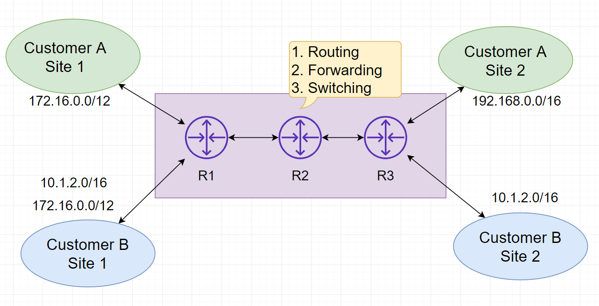

#Multi-Protocol Label Switching (MPLS)

##Topics 
1. MPLS & L3VPN
2. Label based Forwarding 
3. Implementing MPLS
4. Label Distribution Protocols
5. LSP Path Selection
6. LIB, FIB, RIB & CEF
7. LDP Transport Address
8. MPLS L3VPN Architecture
9. Multi-protocol BGP
10. PE-VRF
11. Configure CE-PE routing
12. Import/Export Redistribution 
13. Verify Control & Data Planes
14. VRF enabled commands at PE

# 1 MPLS Fundamentals

* Consider the given network architecture 
* There are two customers A and B sharing services from an ISP with 3 routers R1,R2 & R3 two connects their
remote sites 1 and 2, over a VPN connection 
* notice the private IP space of the customers are colliding (172.16.0.0./12)
* How can the routers keep their __IPs isolate__ from each other? Ans : __MPLS__ (keeping the routing information 
  virtually separate)
* Virtual routing and L3VPN are some of the MPLS services example 
* MPLS solutions are scalable in nature, suitable for enterprise networks 

# 2. Label Based Forwarding 
