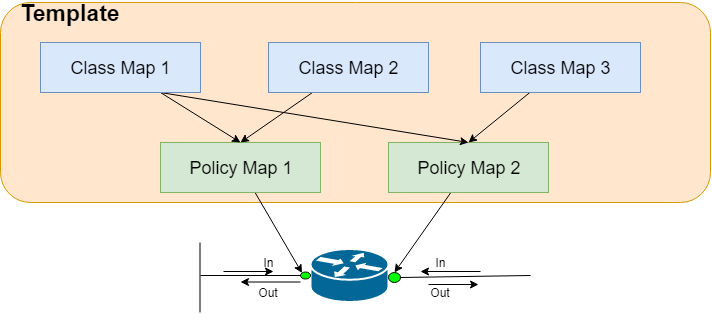

# Quality of Service (QoS)

# Chapter 1:Introduction 
## Topics 
   1. Brief History of QoS
   2. Underlying requirement 
   3. Deploying Methods 
   4. QoS Toolbelt 

## 1.1.  History of QoS
__1992 Best Effort Service :__ 
  > * First come first served 
  > * Application had internal auto recovery mechanism 
  > * with more customers the process fails 
  
__1994 Integrated Services :__
  > * Reservation protocol (RSVP) - reservres bandwidth for communication 
  > * a specific amount of bandwidth is reserved in all routers along a path 
  > * with customer with asymmetric needs, failed the process
  
__1996 Differentiated Service :__
  > * Per hop mechanism for prioritising traffic  
  > * re-prioritization based on various marking 
  
__1998 MPLS/VPN QoS :__ 
  > * allows SP to route at layer 2

__2002 Cisco Auto/template QoS :__
  > * one button many option ! 

__2004 QoS for security :__
  > * Network based application recognition (NBAR) 
  
## 1.2 QoS Requirement 
QoS is not universal rather specific to network traffic type. 
* Data
    >1. Unpredictable - Depends on application
* Voice
    >1. Predictable : G.711 audio codec demands 80kbps/call (no sudden flood)
    >2. Smooth : Constant stream of traffic
    >3. Benign : Once start consuming traffic does'nt ask for more 
    >4. Drop/Delay
    
* Video 
    >1. Predictable : Bursty 
    >2. Greedy : allocates as much as bandwidth it gets 
    >3. Drop/Delay :
    
### Challanges in QoS 
1. __Lac of bandwidth__ - More bandwidth solves problem immediately,  
bit it costs, QoS is meant to combat temporary congestion (next 3 points), not suitable for consistent congestion 
2. __Packet loss__ - 
3. __Delay__ - ITU Standard 150ms (RTT : 300ms) for PSTN
4. __Jitter__ - Delay variation 

## 1.3. Deployment method 
1. __CLI__
   >* Legacy way 
   >* Interface wise configuration is time consuming and redundant  
2. __Modular QoS CLI (MQC)__
    >* Preffered approach
    >* creates groups interface and policy then apply policy on interface group (Policy map)
3. __Auto QoS__
    >* you dont start from scratch 
    >* start with auto and change what is needed 
4. __QoS Policy Manager (QPM)__
    >* GUI based 
    >* Easy to troubleshoot 
 
## 1.4. QoS Toolbelt
1. __Classification and marking tools__
    > * classification involves identifying and grouping different traffic types
    > * Marking is to tag packets based on the policy applied for quick recognition 
2.  __Policing and Shapping__
    > * Policing drops or mark packet when limit reached
    > * Shapping Queues packet when limit is reached (used in speed mismatching links e.g. FR)
3.  __Congestion Avoidence__
    > * FIFO : trail drops
    > * Random Early Detection (RED) : As buffer begins filling up, start dropping packets randomly 
    > * Weighted RED (WRED) : Cisco doesn't support RED, rather demands every packets must be marked with weight 
    and perform RED on top of it 
 4. __Queuing__
    > * Efficiently order the packet
 5. __Link Efficienly tools__
    > * Compression 
    > * link fragmentation and Interleaving (LFI) : To match MTU 
    
# Modular QoS CLI (MQC Standard)
## Topics
1. Understanding MQC standard
2. Configuring Class-map 
3. Configuring Policy-map
4. Applying the service policy 

## Understanding MQC

1. Class-Map: Classify traffic into groups (e.g. HTTP etc.)
2. Policy-Map: What todo with the classes (e.g. Mark, Limit etc.)
3. Apply on the interface as incoming and outgoing traffic (policy-map/interface/direction) 

## 2.2. Configuring Class-map
* Classify or separate traffic 
* Conditional statement is used to classify 

### The class-map command 
~~~
IOU1(config)#class-map ?
  WORD       class-map name
  match-all  Logical-AND all matching statements under this classmap
  match-any  Logical-OR all matching statements under this classmap
  type       Configure CPL Class Map
~~~
* `match-all` is implicit to any class-map, denotes an AND statement 
* `match-any` is explicit and denotes an OR statement 

### Default view of a class map
by defaul the class-default map exists to provision all un-mentioned traffic 
~~~
IOU1(config)#do sh class-map         
 Class Map match-any class-default (id 0)
   Match any 

 Class Map match-all IOU1(config)#class-map (id 2)
   Match none 
~~~

### Create a Class-map

a simple way to think class-map are conditions in IF statements, in conjunction with OR/AND
~~~
IOU1(config)#class-map web-traffic
IOU1(config-cmap)#match protocol http 
IOU1(config-cmap)#match packet length min 400 max 600
IOU1(config-cmap)#do sh class-map
 Class Map match-any class-default (id 0)
   Match any 

 Class Map match-all web-traffic (id 1)
   Match protocol http
   Match packet length  400-600

 Class Map match-all IOU1(config)#class-map (id 2)
   Match none 
~~~

## 2.3. Configure Policy map
### Ceate a policy-map 
~~~
IOU1(config)#policy-map ?

  WORD  policy-map name
  type  type of the policy-map
~~~

### Name the policy map 
~~~
IOU1(config)#policy-map limit_http

IOU1(config-pmap)#?
Policy-map configuration commands:
  class        policy criteria
  description  Policy-Map description
  exit         Exit from policy-map configuration mode
  no           Negate or set default values of a command
~~~

### Define the CLass-map its applying to

~~~
IOU1(config-pmap)#class web-traffic 

IOU1(config-pmap-c)#?
Policy-map class configuration commands:
  admit            Admit the request for 
  bandwidth        Bandwidth
  compression      Activate Compression
  drop             Drop all packets
  exit             Exit from class action configuration mode
  fair-queue       Enable Flow-based Fair Queuing in this Class
  flow             Flow subcommands
  log              Log IPv4 and ARP packets
  measure          Measure
  netflow-sampler  NetFlow action
  no               Negate or set default values of a command
  police           Police
  priority         Strict Scheduling Priority for this Class
  queue-limit      Queue Max Threshold for Tail Drop
  random-detect    Enable Random Early Detection as drop policy
  service-policy   Configure QoS Service Policy
  set              Set QoS values
  shape            Traffic Shaping

~~~

### Apply intended action on that class(es)
~~~
IOU1(config-pmap-c)#police 500000 !limit bw to 500Kbps
~~~

### 