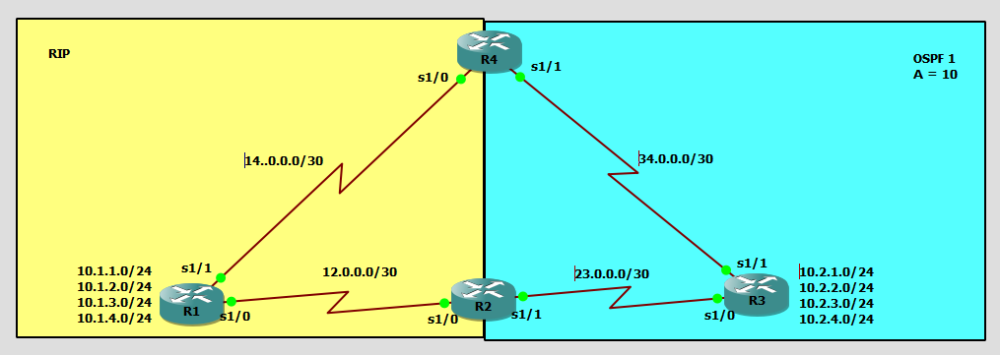

# Initial topology

## Base config
__Router 1__
```
!r1
conf t
	int s1/0
		ip add	12.0.0.1 255.255.255.252
		no sh	
	
	int s1/1
		ip add 14.0.0.1 255.255.255.252
		no sh 
	
	int l1
		ip add 10.1.1.1 255.255.255.0
	int l2
		ip add 10.1.2.1 255.255.255.0
	int l3
		ip add 10.1.3.1 255.255.255.0
	int l4
		ip add 10.1.4.1 255.255.255.0
end
conf t
	router rip 
		ver 2
		no auto 
		
		net 12.0.0.0
		net 14.0.0.0
		
		net 10.1.1.0
		net 10.1.2.0
		net 10.1.3.0
		net 10.1.4.0
end 
```
__Router 2__
```
!r2
conf t
	int s1/0
		ip add 12.0.0.2 255.255.255.252
		no sh 
	
	int s1/1
		ip add 23.0.0.1 255.255.255.252
		no sh 
end
conf t
	router rip
		ver 2
		no auto 
		
		net 12.0.0.0
	exit

	router ospf 1
		passive def 
		net 23.0.0.1 0.0.0.0 a 0
		no
```
__Router 3__
```
!r3
conf t
	int s1/0
		ip add 23.0.0.2 255.255.255.252
		no sh
	
	int s1/1
		ip add 34.0.0.1 255.255.255.252
		no sh 
	
	int l1
		ip add 10.2.1.1 255.255.255.0
	int l2
		ip add 10.2.2.1 255.255.255.0
	int l3
		ip add 10.2.3.1 255.255.255.0
	int l4
		ip add 10.2.4.1 255.255.255.0
end 
conf t
	router ospf 1
		passive def
		net 23.0.0.2 0.0.0.0 a 0
		net 34.0.0.1 0.0.0.0 a 0
		
		net 10.2.1.1 0.0.0.0 a 0
		net 10.2.2.1 0.0.0.0 a 0
		net 10.2.3.1 0.0.0.0 a 0
		net 10.2.4.1 0.0.0.0 a 0
		no passive s1/0
		no passive s1/1
end 
```

__Router 4__
```!r4
conf t
	int s1/0
		ip add 14.0.0.2 255.255.255.252
		no sh 
	
	int s1/1
		ip add 34.0.0.2 255.255.255.252
		no sh 
end 
conf t
	router rip 
		no auto
		ver 2
		net 14.0.0.0 
	exit
	
	router ospf 1
		passive def 
		net 34.0.0.2 0.0.0.0 a 0
		no passive s1/1
end 
```
## Routing Tables 
__R1__
```
     10.0.0.0/24 is subnetted, 4 subnets
C       10.1.3.0 is directly connected, Loopback3
C       10.1.2.0 is directly connected, Loopback2
C       10.1.1.0 is directly connected, Loopback1
C       10.1.4.0 is directly connected, Loopback4
     12.0.0.0/30 is subnetted, 1 subnets
C       12.0.0.0 is directly connected, Serial1/0
     14.0.0.0/30 is subnetted, 1 subnets
C       14.0.0.0 is directly connected, Serial1/1
```

__R2__
```     34.0.0.0/30 is subnetted, 1 subnets
O       34.0.0.0 [110/128] via 23.0.0.2, 00:15:03, Serial1/1
     23.0.0.0/30 is subnetted, 1 subnets
C       23.0.0.0 is directly connected, Serial1/1
     10.0.0.0/8 is variably subnetted, 8 subnets, 2 masks
O       10.2.1.1/32 [110/65] via 23.0.0.2, 00:16:28, Serial1/1
R       10.1.3.0/24 [120/1] via 12.0.0.1, 00:00:17, Serial1/0
R       10.1.2.0/24 [120/1] via 12.0.0.1, 00:00:17, Serial1/0
O       10.2.3.1/32 [110/65] via 23.0.0.2, 00:16:28, Serial1/1
R       10.1.1.0/24 [120/1] via 12.0.0.1, 00:00:19, Serial1/0
O       10.2.2.1/32 [110/65] via 23.0.0.2, 00:16:30, Serial1/1
O       10.2.4.1/32 [110/65] via 23.0.0.2, 00:16:30, Serial1/1
R       10.1.4.0/24 [120/1] via 12.0.0.1, 00:00:19, Serial1/0
     12.0.0.0/30 is subnetted, 1 subnets
C       12.0.0.0 is directly connected, Serial1/0
     14.0.0.0/30 is subnetted, 1 subnets
R       14.0.0.0 [120/1] via 12.0.0.1, 00:00:21, Serial1/0
```

__R3__
```
     34.0.0.0/30 is subnetted, 1 subnets
C       34.0.0.0 is directly connected, Serial1/1
     23.0.0.0/30 is subnetted, 1 subnets
C       23.0.0.0 is directly connected, Serial1/0
     10.0.0.0/24 is subnetted, 4 subnets
C       10.2.1.0 is directly connected, Loopback1
C       10.2.2.0 is directly connected, Loopback2
C       10.2.3.0 is directly connected, Loopback3
C       10.2.4.0 is directly connected, Loopback4
```

__R4__
```     34.0.0.0/30 is subnetted, 1 subnets
C       34.0.0.0 is directly connected, Serial1/1
     23.0.0.0/30 is subnetted, 1 subnets
O       23.0.0.0 [110/128] via 34.0.0.1, 00:16:30, Serial1/1
     10.0.0.0/8 is variably subnetted, 8 subnets, 2 masks
O       10.2.1.1/32 [110/65] via 34.0.0.1, 00:16:30, Serial1/1
R       10.1.3.0/24 [120/1] via 14.0.0.1, 00:00:16, Serial1/0
R       10.1.2.0/24 [120/1] via 14.0.0.1, 00:00:16, Serial1/0
O       10.2.3.1/32 [110/65] via 34.0.0.1, 00:16:30, Serial1/1
R       10.1.1.0/24 [120/1] via 14.0.0.1, 00:00:17, Serial1/0
O       10.2.2.1/32 [110/65] via 34.0.0.1, 00:16:32, Serial1/1
O       10.2.4.1/32 [110/65] via 34.0.0.1, 00:16:32, Serial1/1
R       10.1.4.0/24 [120/1] via 14.0.0.1, 00:00:17, Serial1/0
     12.0.0.0/30 is subnetted, 1 subnets
R       12.0.0.0 [120/1] via 14.0.0.1, 00:00:19, Serial1/0
     14.0.0.0/30 is subnetted, 1 subnets
C       14.0.0.0 is directly connected, Serial1/0
```

### A change in OSPF config
notice the routes recived from OSPF domains, have changed into `/32` 
despite of setting it /24. this is because the 

## Perform Redistribution with __R2__ only

