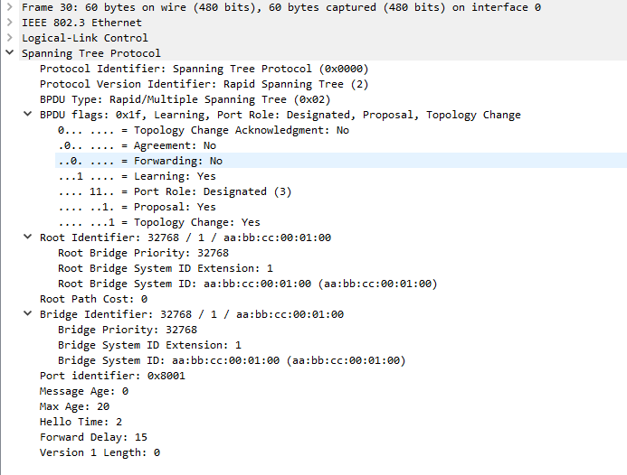
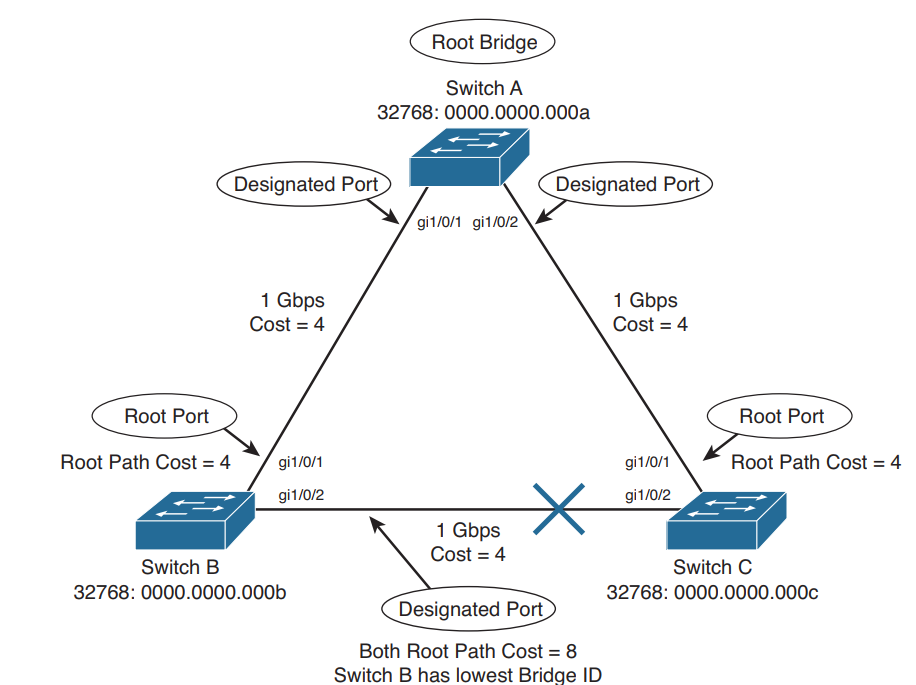
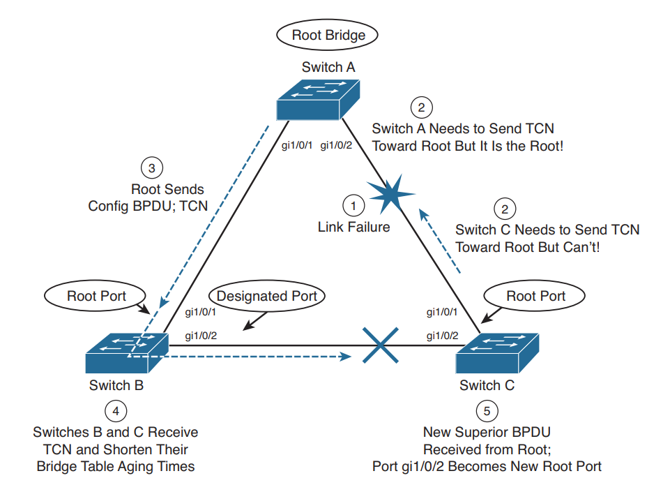
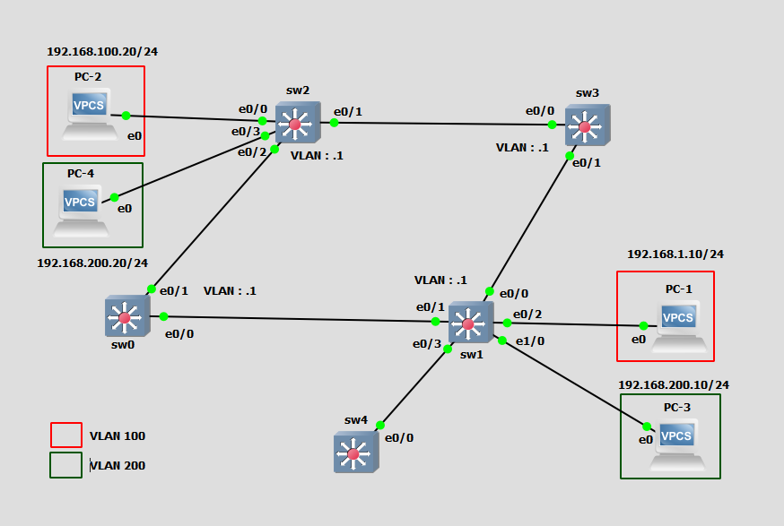
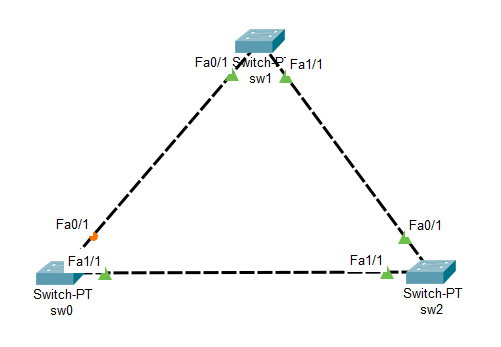

Spanning Tree Protocol 
======================

# STP Basics
### Redundancy and Loops
* Prevents switching loops 
* Original 802.1D for loop prevention 
* Bridge Protocol Data Unit (BPDU) : for probing and loop detection 
* __Boomering__ : 
* __Network Diameter__ : Max hop in a L2 networks. 
    > + Cisco recommends to limit diameter at 7  
    > + BPDU is transmitted (by default) each 2 sec, large diameter may collide two BPDU packets 
* STP doesn't send BPDU on port fast link
    
### Simple Rules of STP 
* BPDU : | Priority | MAC | 
* BPDU type
    > 1. Configuration BPDU : periodic by 2 sec 
    > 2. Topology Change Notification (TCN) : When link change is detected 

    
### Root bridge election 
* Election is based on bridge ID (Lowest ID wins)
    > 1. priority (0-65535, default : 32768), multiple of 4096 (VLAN ID)
    > 2. MAC Address - Back plane MAC (Lower = Older is prioritised)
* an old switch may throttle the CPU with massive STP load, thus priority is changed manually 

### Root Election 
* All ports of RB is Designated Port (DP)
* All NRB switch makes Root Port (RP) that connects RB
* 

### STP Path cost 
* STP assigns a cost based on link speed 
    > 4 Mbps    : 250  
     __10 Mbps   : 100__  
     16 Mbps   : 62   
     45 Mbps   : 39   
     __100 Mbps  : 19__  
     155 Mbps  : 14   
    622 Mbps  : 6    
     __1 Gbps    : 4__    
     __10 Gbps   : 2__    
     
### STP States
1. disable  :   down by admin 
2. blocking :   to prevent loops , received BPDU, cant send/receive data
3. listening :   

    

### STP Timers 
1. __Hello__ : BPDU sent by root bridge 802.1d (2Sec)
2. __Forwarding Delay__ : Spend in listening and learning states (15 Sec X 2 = 30 Sec)
3. __max Age time__ : 20 sec (if not received by 20 sec, means the link has problem)

### Effect of topology change 
 
 _Recalculation of Links takes 30 secs : Not Acceptable !_ 

### Indirect Topology Change 
due to data filter, switch stops receiving BPDU, delay of (20 + 2 + 15 + 15 ) 52 sec default 

### Per-VLAN Spanning tree (PVST)
* Spanning tree for each VLAN (Each VLAN logically gets its own RB)

# STP Lab

### Reference Topology 

## Initial Config (VLAN & Trunk)

__switch0__
~~~
! sw0
conf t
	!------------------------------------------
	!CREATING VLANS
	!------------------------------------------
	vlan 100
	name sales
	exit

	vlan 200
	name engg
	exit

	!------------------------------------------
	!CREATING TRUNKS
	!------------------------------------------
	int range e0/0-1
	sw tr encap dot
	sw mode tr

	!------------------------------------------
	!ACTIVATING PVST
	!------------------------------------------
	spanning-tree mode pvst
end
~~~
__Switch1__
~~~
! sw1
conf t
	!------------------------------------------
	!CREATING VLANS
	!------------------------------------------
	vlan 100
	name sales
	exit

	vlan 200
	name engg
	exit

	!------------------------------------------
	!CREATING ACCESS PORTS
	!------------------------------------------
	int e0/2
	sw mode acc
	sw acc vlan 100

	int e1/0
	sw mode acc
	sw acc	vlan 200
	
	!------------------------------------------
	!CREATING TRUNKS
	!------------------------------------------
	int range e0/0-1, e0/3
	sw tr encap dot
	sw mode tr
	
	!------------------------------------------
	!ACTIVATING PVST
	!------------------------------------------
	spanning-tree mode pvst
end
~~~
__Switch2__
~~~
! sw2
conf t	
	!------------------------------------------
	!CREATING VLANS
	!------------------------------------------
	vlan 100
	name sales
	exit

	vlan 200
	name engg
	exit

	!------------------------------------------
	!CREATING ACCESS PORTS
	!------------------------------------------
	int e0/0
	sw mode acc
	sw acc vlan 100
	
	int e0/3
	sw mode acc
	sw acc vlan 200

	!------------------------------------------
	!CREATING TRUNKS
	!------------------------------------------
	int range e0/1-2
	sw tr encap dot
	sw mode tr

	!------------------------------------------
	!ACTIVATING PVST
	!------------------------------------------
	!spanning-tree mode pvst
end
~~~

__Switch3__
~~~
! sw3
conf t
	!------------------------------------------
	!CREATING VLANS
	!------------------------------------------
	vlan 100
	name sales
	exit

	vlan 200
	name engg
	exit

	!------------------------------------------
	!CREATING TRUNKS
	!------------------------------------------
	int range e0/0-1
	sw tr encap dot
	sw mode tr

	!------------------------------------------
	!ACTIVATING PVST
	!------------------------------------------
	spanning-tree mode pvst
end
~~~

### Verify VLAN Connectivity 
~~~
PC-1> sh ip 

NAME        : PC-1[1]
IP/MASK     : 192.168.100.10/24
GATEWAY     : 0.0.0.0
DNS         : 
MAC         : 00:50:79:66:68:00
LPORT       : 10012
RHOST:PORT  : 127.0.0.1:10013
MTU:        : 1500

PC-1> ping 192.168.100.20
84 bytes from 192.168.100.20 icmp_seq=1 ttl=64 time=1.371 ms
84 bytes from 192.168.100.20 icmp_seq=2 ttl=64 time=2.388 ms
84 bytes from 192.168.100.20 icmp_seq=3 ttl=64 time=2.079 ms
^C
PC-1> ping 192.168.200.10
No gateway found
~~~

### Verify Spannig Tree Status 
~~~
sw0#sh spanning-tree 

VLAN0001
  Spanning tree enabled protocol ieee
  Root ID    Priority    32769
             Address     aabb.cc00.0100
             This bridge is the root
             Hello Time   2 sec  Max Age 20 sec  Forward Delay 15 sec

  Bridge ID  Priority    32769  (priority 32768 sys-id-ext 1)
             Address     aabb.cc00.0100
             Hello Time   2 sec  Max Age 20 sec  Forward Delay 15 sec
             Aging Time  300 sec

Interface           Role Sts Cost      Prio.Nbr Type
------------------- ---- --- --------- -------- --------------------------------
Et0/0               Desg FWD 100       128.1    Shr 
Et0/1               Desg FWD 100       128.2    Shr 
[...]
Et3/2               Desg FWD 100       128.15   Shr 
Et3/3               Desg FWD 100       128.16   Shr 
                         
VLAN0100  
  Spanning tree enabled protocol ieee
  Root ID    Priority    32868
             Address     aabb.cc00.0100
             This bridge is the root
             Hello Time   2 sec  Max Age 20 sec  Forward Delay 15 sec
          
  Bridge ID  Priority    32868  (priority 32768 sys-id-ext 100)
             Address     aabb.cc00.0100
             Hello Time   2 sec  Max Age 20 sec  Forward Delay 15 sec
             Aging Time  300 sec
          
Interface           Role Sts Cost      Prio.Nbr Type
------------------- ---- --- --------- -------- --------------------------------
Et0/0               Desg FWD 100       128.1    Shr 
Et0/1               Desg FWD 100       128.2    Shr 
          
          
          
VLAN0200  
  Spanning tree enabled protocol ieee
  Root ID    Priority    32968
             Address     aabb.cc00.0100
             This bridge is the root
             Hello Time   2 sec  Max Age 20 sec  Forward Delay 15 sec
          
  Bridge ID  Priority    32968  (priority 32768 sys-id-ext 200)
             Address     aabb.cc00.0100
             Hello Time   2 sec  Max Age 20 sec  Forward Delay 15 sec
             Aging Time  300 sec
          
Interface           Role Sts Cost      Prio.Nbr Type
------------------- ---- --- --------- -------- --------------------------------
Et0/0               Desg FWD 100       128.1    Shr 
Et0/1               Desg FWD 100       128.2    Shr 
~~~
### check the priority and BIA of a Switch 
~~~
sw0#sh spanning-tree detail | inc Br
  Bridge Identifier has priority 32768, sysid 1, address aabb.cc00.0100
~~~

### Altering per-VLAN RB
* Make sw0 as RB of VLAN 100
* make sw3 as RB of VLAN 200

~~~
sw0(config)#spanning-tree vlan 100 root primary 
~~~
~~~
sw3(config)#spanning-tree vlan 200 root primary 
~~~

### Some commonly used command 
~~~
sh spanning-tree vlan [id]
~~~
~~~
sh spanning-tree interface e0/1 ?             
  active         Report on active instances only
  cost           Port path cost
  detail         Detailed information
  inconsistency  Port inconsistency state
  portfast       Portfast operational status
  priority       Port priority
  rootcost       Path cost to root
  state          Port spanning tree state
  |              Output modifiers
  <cr>
~~~

### Tuning STP Convergence 
~~~
spanning-tree (vlan vlan-id) hello-time [sec]
spanning-tree (vlan vlan-id) forward-time [sec]
spanning-tree (vlan vlan-id) max-age [sec]

spanning-tree vlan [vlan-list] root {pri | sec} (dia [d] (hello-time [sec]))
~~~

### STP link Convergence 

~~~
sw1(config)#spanning-tree ?
  backbonefast  Enable BackboneFast Feature
  portfast      Spanning tree portfast options
  uplinkfast    Enable UplinkFast Feature
~~~

* __PortFast__ : Fast servers with SSD boots in 5-6 secs, but switch takes 30 sec to learn :( 
    > * used for access layer switches connecting end-devices
    > * can be enabled globally (all not trunk ports) but not recommended 
    > * for interface specific 
    
    > ~~~
    > interface [int-name]  
    > spanning-tree portfast 
        
* __Uplink Fast__ : Switching between primary and backup link fast 
    > * applicable for non RB. 
    > * when primary link fails, dummy multicast is sent on 0100:0CCD:CDCD address
    > * All CAM entries are advertised at backup link  
    >~~~
    > spanning-tree uplinkfast
* __Backbone_Fast__ : Fast Convergence in __indirect__ link failure 
    > * let A,B,C are connected as triangle, A be the RB
    > * link A-C failed due to filtering etc
    > * C didn't receive any bpdu untill its max-age 
    > * C makes itself RB and generated BPDU to B (insignificant BPDU)
    > * B receives two BPDU from A (root port) and C (blocking port)
    > * in __Backbone-fast__ B sends a Root-link query (__RLQ__) to verify root liveliness to A
    > * B __shorten__ the time and puts blocked port to forwarding state 

# STP troubleshooting 
## Types of STP ports 
1. __Root port__ : port on switch, closest (with lowest path cost) to root bridge 
2. __Designated port__ : port on LAN segment closest to root. Relays, forward and transmit BPDU down the tree
3. __Blocking port__ : neither Root not Designated 
4. __Alternate port__ : backup in the case of `Uplink-Fast`, ideally blocked 
5. __Forwarding Port__ : where no STP is detected, connected to end=-users
__Up/Down Stream__ : position on the STP tree, based on forwarding of BPDU 

## Protecting against unexpected BPDU

### Root Guard 
* No way this can be a root port 
* relay/ forward BPDU but can't receive 
* by default disabled 
* typically used to ignore a specific switch (legacy one) or untrusted port (security reason)
~~~
sw(config-if)spanning-tree guard root 
sh spanning-tree inconsistenceport 
~~~ 

* in this sample topology sw2 is the RB 
* now prevent fa0/1 to be a root port  

### BPDU Guard
* Port fast : straightaway goes to forwarding state, always use on end-device 
* port-fast is not same as disabling STP 
* if BPDU guard is enabled on a portfast enabled interface, while __receiving any BPDU__ there, interface goes to __error-disable__ state
* The guard is to maintain integrity. 
* to enable BPDU-guard on all port fast interfaces `sw(config)# spanning-tree portfast bpduguard default`
* if the interface is connected to a __hub__ then BPDU guard __can't protect__
  as hubs don't use spanning tree, hence __no bpdu__

## Protecting against sudden loss of BPDU
